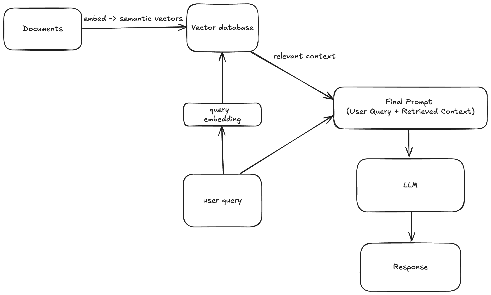

# rag-lifecycle-demo

## Architecture

This project implements a **Retrieval-Augmented Generation (RAG)** pipeline, enabling a Large Language Model (LLM) to answer user questions using relevant context from a custom document set.

### High-level flow

1. **Document Embedding & Storage**

   - Source documents are split into chunks.
   - Each chunk is converted into a **semantic vector embedding** using an embedding model.
   - Embeddings are stored in a **vector database** for similarity search.

2. **Query Processing**

   - The user query is embedded using the _same_ embedding model, ensuring both documents and queries live in the same semantic space.
   - The vector database retrieves the top-_k_ most relevant document chunks based on vector similarity.

3. **Prompt Assembly**

   - Retrieved context is combined with the original query to form the **Final Prompt**.
   - The final prompt is sent to the LLM.

4. **Response Generation**
   - The LLM generates a grounded response using both the query and the retrieved context.

---

### Architecture Diagram



## Quick Start

### Requirements

- Python 3.11 (recommended)
- Ollama running locally (`ollama serve`)
- Models:
  - `nomic-embed-text:latest` (embeddings)
  - `qwen3:8b` (LLM) — or any pulled chat model

### Setup MacOS/Linux

```bash
python3.11 -m venv .venv
source .venv/bin/activate
python -m pip install --upgrade pip setuptools wheel
pip install -r requirements.txt
ollama pull nomic-embed-text:latest
ollama pull qwen3:8b
```

**Note**: The requirements now include additional dependencies for Week 3 document processing:

- `beautifulsoup4`: HTML parsing and text extraction
- `markdown`: Markdown processing
- `PyPDF2`: PDF text extraction

### Setup Windows

```powershell
py -3.11 -m venv .venv
.\.venv\Scripts\Activate.ps1
python -m pip install --upgrade pip setuptools wheel
pip install -r requirements.txt
ollama pull nomic-embed-text:latest
ollama pull qwen3:8b
```

**Note**: The requirements now include additional dependencies for Week 3 document processing:

- `beautifulsoup4`: HTML parsing and text extraction
- `markdown`: Markdown processing
- `PyPDF2`: PDF text extraction

### Run the app

Option A — Python directly:

```bash
python main.py
```

Option B — via npm scripts (added in this repo):

```bash
npm run dev
```

## Week 4 — Vector Storage (Python stack)

This week we add FAISS-backed vector search and keep raw text/metadata in SQLite.

### Install/verify vector deps (already in requirements)

```bash
source .venv/bin/activate
pip install -r requirements.txt
```

> If you created a new venv with Python 3.11, you should see `faiss-cpu` and `sentence-transformers` install without NumPy pin issues.

### Initialize/prepare data

- Ensure you have ingested some documents so `vectors.db` has rows in `documents` and `vectors`.
- If you need to (re)initialize the schema: `npm run db:init` or `python src/db.py --init`

### Smoke-test embeddings

```bash
python -c "from src.embeddings.encode import load, embed_texts; load(); import numpy as np; v=embed_texts(['hello world']); print(v.shape, v.dtype)"
```

Expected: something like `(1, 384) float32` printed.

### Build FAISS index from SQLite vectors

```bash
# Build a cosine (normalized IP) index from SQLite vectors
python -m src.store.faiss_index build --db vectors.db --out var/index

# Smoke-test a query against the FAISS index
python -m src.store.faiss_index search "what is the repo about?" --k 5 --out var/index --db vectors.db
```

Artifacts:

- `var/index/index.faiss` — FAISS index
- `var/index/ids.json` — ordered mapping of FAISS ids → `documents.id`
- `var/index/meta.json` — metadata (dim, count, model, db_path)

### Retrieve top-k (developer API)

```python
# example usage pattern from Python
from src.store.faiss_index import search
hits = search("what is the repo about?", k=5)
for h in hits:
    print(h["score"], h["text"][:120])
```

### Use FAISS via .env or explicitly

- Option A — .env toggle (automatic in Python retrieval):
  - Add to `.env`:
    - `USE_FAISS=true`
    - Ensure `HYBRID=false` if you want pure FAISS (hybrid takes precedence).
  - Code paths that call `src.retrieve.retrieve()` will use FAISS when available; they fall back to cosine on errors.
  - Optional: set an absolute index directory for portability:
    - `INDEX_DIR=/Users/you/Work/rag-lifecycle-demo/var/index`
    - If unset, defaults to `var/index` relative to the working directory.

- Option B — explicit method (API):
  - Start API: `python api.py`
  - Retrieve with FAISS:
    ```bash
    curl -s localhost:8000/retrieve \
      -H 'Content-Type: application/json' \
      -d '{"query":"what is the repo about?","k":5,"method":"faiss"}' | jq .
    ```
  - Full RAG with FAISS retrieval:
    ```bash
    curl -s localhost:8000/rag \
      -H 'Content-Type: application/json' \
      -d '{"query":"what is the repo about?","k":5,"method":"faiss"}' | jq .
    ```

Notes:
- Build the FAISS index first (see above) before enabling FAISS retrieval.
- If FAISS isn’t built/loaded, the code safely falls back to cosine.
- Guardrails: When loading the index, the code compares `meta.json.count` with the SQLite `vectors` count and prints a warning if they differ. If you ingest new data, rerun `npm run faiss:rebuild` to refresh the index.

### Harness validation (Node)

Use the existing eval harness to check retrieval coverage against `golden.json`:

```bash
npm run eval
```

## Week 3 — Document Ingestion

The enhanced ingestion pipeline supports multiple document formats with structured processing and deterministic IDs.

### Supported Formats

- **Text files** (`.txt`): Basic text processing
- **Markdown files** (`.md`): Heading-based block extraction with title preservation
- **HTML files** (`.html`): Text extraction with title and paragraph separation
- **PDF files** (`.pdf`): Page-based processing with paragraph extraction

### Basic Usage

```bash
# Ingest a single file
npm run ingest -- --path sample/sample.md

# Ingest all supported files in a directory
npm run ingest -- --path sample/

# Custom chunking parameters
npm run ingest -- --path sample/ --chunk-size 300 --chunk-overlap 25
```

### Features

- **Block-based processing**: Documents are first split into logical blocks (sections, paragraphs, pages)
- **Deterministic IDs**: Content-based hashing ensures identical content gets the same ID
- **Duplicate detection**: Automatic skipping of existing documents and embeddings
- **Metadata preservation**: Source, title, page numbers, and section information
- **Idempotent operation**: Safe to run multiple times without creating duplicates

### Database Management

```bash
# Initialize database schema
npm run db:init

# Force reinitialize (drops existing data)
npm run db:reinit

# Check database statistics
npm run db:stats

# Optimize database
npm run db:vacuum

# Create WAL checkpoint
npm run db:checkpoint
```

### Environment Variables

- `CHUNK_SIZE`: Maximum characters per chunk (default: 500)
- `CHUNK_OVERLAP`: Overlap between chunks (default: 50)
- `TOP_K`: Number of results to retrieve (default: 5)
- `HYBRID`: Enable hybrid search (default: false)

### Troubleshooting

**Python version mismatch:** Use Python 3.11. If you see errors like `No matching distribution found for numpy>=1.26`, your venv is likely on Python 3.8–3.10. Recreate it with `python3.11 -m venv .venv` and reinstall requirements.

**Missing dependencies**: If you encounter `ModuleNotFoundError` for `bs4`, `markdown`, or `PyPDF2`, run:

```bash
pip install -r requirements.txt
```

**PDF processing**: PDF support requires `PyPDF2`. If you don't need PDF support, you can skip this dependency.

**Database schema changes**: If you encounter database errors after schema updates, run:

```bash
npm run db:reinit
```

### Run the tests (eval harness)

The evaluation harness calls Ollama's generate endpoint using unified env vars.

```bash
# optional, defaults shown
export OLLAMA_BASE_URL=http://localhost:11434
export OLLAMA_MODEL=llama3.1:8b

npm run eval
# or
node eval/run.mjs eval/tests/golden.json
```

### Compare two specific archived test runs

node eval/compare.mjs eval/runs/<old>.json eval/runs/<new>.json --golden eval/tests/golden.json

### Compare newest vs previous (no args!)

node eval/compare.mjs

### Compare newest vs 3rd previous

node eval/compare.mjs --prev 3

### Golden auto-used if present, or pass explicitly

node eval/compare.mjs --prev 2 --golden eval/tests/golden.json

### Environment variables

- `OLLAMA_BASE_URL`: Base URL for Ollama (used by both Python and Node evals). Defaults to `http://localhost:11434`.
- `OLLAMA_MODEL`: Model name/tag to use for evals (default `llama3.1:8b`).
- `LLM_MODEL`: Model used by the Python demo app (read by `config.py`).
