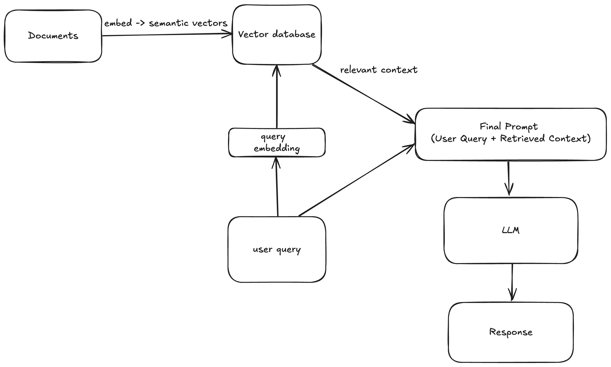

# Week 1:

## Goal:

To connect a LLM to a vector database.

### Decisions & Trade-offs

    •	Embedding model: nomic-embed-text:latest — local, free; good enough for learning.
    •	LLM model: llama3.1:8b — light, decent instruction-following on Mac.
    •	Store: in‑memory + cosine similarity — simple, fast to grasp; not persistent.
    •	Chunking: N/A (using full sentences); to revisit next week.
    •	Why cosine: direction over magnitude; better semantic match.
    •	Known limits: no persistence; small context; model sometimes hallucinates terms.
